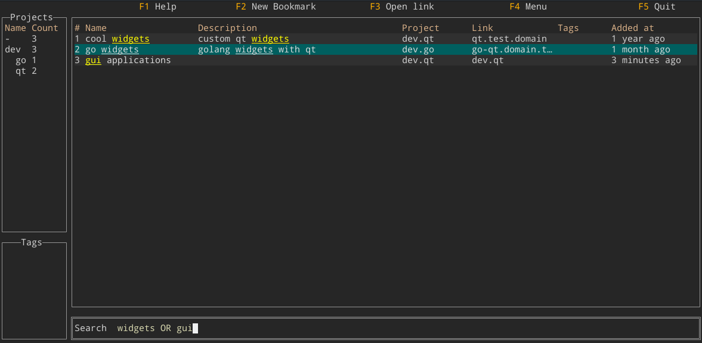

# Bookmarker




Bookmarker is a terminal application to manage and view bookmarks. 

# Known bugs
* Tags don't work as expected

# Features
* Assign any key-value metadata (currently editable in config file) 
* Advanced searching. Search can be simple like 'bookmark*', or more advanced: 'author:davis project:study link:archives.com'
* Store IPFS & web archive links directly with corresponding bookmark
* Import existing bookmarks from bookmarks.html-browser-exports (no exporting yet)
* Customize color scheme
* Archived status 
* Sort bookmarks

# Searching & filtering
At the moment Bookmarker applies either full text query or filtering. Full-text-queries apply to any metadata keys and values.
Some examples of full text queries that are supported:
```
# Full-text-query
help page       -> match any phrase that has words help and page
"help page"     -> match any phrase that has phrase "help page"
help pag*       -> match any phrase that has help and pag*, where * is wildcard
help AND page OR site -> logical combining
'^help'         -> phrase must start with help

# Filtering
link:github.com                 -> only bookmarks urls with text github.com
project:test link:github.com    -> must contain both clauses
author:"dave" language:english -link:mypage.com -> author must match language must contain, link cannot contain given text
```

for more info on full text search syntax see [Sqlite FTS5 extension](https://www.sqlite.org/fts5.html#full_text_query_syntax).

# Building
Assuming go already installed, download package and build it.
**You must add build tag 'fts5'** before running application for database schema to be built properly and full-text-search to work. You can always revert the migration (by hand, at the moment) or delete the database file if it's still empty.
```
go get tryffel.net/go/bookmarker

# cd to bookmarker-root
go build --tags 'fts5' .
```

Cross-compile to windows using e.g. docker image x1unix/go-mingw (1.16):
```
GOOS=windows GOARCH=amd64 go build --tags 'fts5' .
```

Bookmarker works on Windows too, but might is not optimized for Windows environment.  
This occurs mostly as a visual effect of poor layouts and colors.

# Config
During first run, Bookmarker will create a default config directory to ~/.config/bookmarker. This includes config file 'bookmarker.toml', database and log file. 

Config file can be set with ```--config``` flag. This will create new file and directories, if they don't exist. 
Usage:
```
./bookmarker --config /my/dir/config.toml
```

After this, all data will be at directory /my/dir by default. This can be customised in config file.
